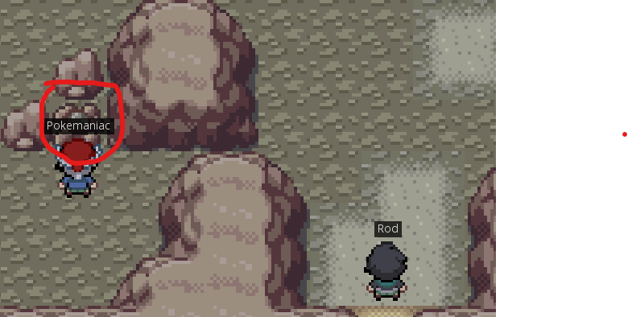

# PokeForce Mining Bot
If you enjoy this bot please consider giving the repository a star!

## Installing dependencies
1. Install Python3, I'm using 3.11 but most versions should work.
2. Installed the required packages using `pip install -r requirements.txt`
3. Run the bot using `python3 miner.py`

## Configuring the bot
1. Currently there's only one image used as reference for the bot. My resolution is 2650x1440, so if you have a different resolution you MIGHT need to change the image.

## How to use
1. Position yourself in front of the first ore and facing it.
2. Run the bot using a Powershell with administrator rights. 
3. Quicly switch to the game window. Right now the bot has a .5s delay before starting to mine, so you have time to switch windows.

Image of the first ore:

### Known limitation
1. The bot will only mine the 6 ores and doesn't yet farm the most valuable ones because I need to time the cooldowns.

